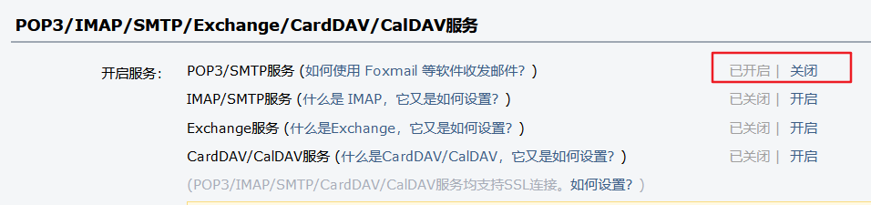
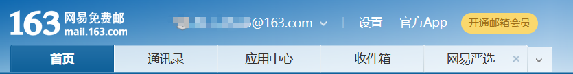

# 邮箱验证Demo
#### 基于Java的邮箱发送验证码的Demo
# 环境配置
#### 请配置maven使用
# <span id="#1">使用准备</span>
#### QQ邮箱
1. 点击邮箱设置<br/>

2. 点击账户选项，查看如下图所示内容<br/>

3. 点击上图红圈所示地方开启链接，按照提示进行即可<br/>
4. 保存密码
#### 网易邮箱
1. 点击邮箱设置<br/>

2. 点击“POP3/SMTP/IMAP”选项<br/>

3. 点击开启下图红圈所示内容<br/>

4. 保存密码
#### Gmail
1. 点击“管理你的Google账号”<br/>

2. 点击“安全性”<br/>

3. 点击开启“两步验证”<br/>

4. 按照提示完成所需步骤后，可在步骤3图片红圈下面看到一个应用专用密码<br/>

5. 点击创建即可
6. 保存密码
# 使用提示
#### [更换邮箱为自己的邮箱，更换密码为自己的密码](src/main/java/org/fade/verify/utils/EmailUtil.java)，密码为[使用准备](#1)里生成的密码
```java
//发送者邮箱
    //TODO: use your own email
    private static String fromEmail = "@qq.com";
//    private static String fromEmail = "@163.com";
//    private static String fromEmail = "@gmail.com";

    //发送者密码
    //TODO: use your own password
    private static String fromEmailPw = "";
//    private static String fromEmailPw = "";
//    private static String fromEmailPw = "";
```
#### [把发送方邮箱服务器更换为相应厂商的邮箱服务器](src/main/java/org/fade/verify/utils/EmailUtil.java)
```java
//发送邮箱服务器
    private static String myEmailSMTPHost = "smtp.qq.com";
//    private static String myEmailSMTPHost = "smtp.gmail.com";
```
#### [Gmail不仅需要开启SSL，还需要设置代理，需要魔法上网](src/main/java/org/fade/verify/utils/EmailUtil.java)
```java
//设置开启SSL,Gmail必须开启,QQ或网易可以设置不开启
        MailSSLSocketFactory sf = new MailSSLSocketFactory();
        sf.setTrustAllHosts(true);
        props.put("mail.smtp.ssl.enable", "true");
        props.put("mail.smtp.ssl.socketFactory", sf);
//        props.setProperty("mail.smtp.socketFactory.port", "465");
        //Gmail请设置代理，需魔法上网，
        // 相应服务器地址、端口请更换为自己的代理服务器地址和端口
//        props.setProperty("mail.smtp.socks.host","127.0.0.1");
//        props.setProperty("mail.smtp.socks.port","7890");
```
#### [验证码可以设置长度，也可以自定义修改验证码格式](src/main/java/org/fade/verify/utils/VerificationCodeUtil.java)
```java
/**
     * 生成n位验证码
     * @param length 验证码长度
     * */
    public static String generateVerificationCode(int length){
        StringBuilder sb = new StringBuilder();
        Random random = new Random();
        for(int i = 0;i<length;i++){
            //type为当前位类型：小写字母(2)、数字(0)、大写字母(1)
            int type = random.nextInt(3);
            int content = 0;
            switch (type){
                case 0:
                    content = random.nextInt(10) + 48;
                    break;
                case 1:
                    content = random.nextInt(26) + 65;
                    break;
                case 2:
                    content = random.nextInt(26) + 97;
                    break;
                default:
                    break;
            }
            sb.append((char)content);
        }
        return sb.toString();
    }
```
#### [在测试区可以测试例子](src/test/java/org/fade/verify/SendVerifyEmailTest.java)
```java
/**
     * 测试发送验证码邮件
     * */
    @Test
    public void testSendVerifyEmail() {
        //测试地址一(国内)
//        String toEmail = "@foxmail.com";
        //测试地址三(国内网易)
        String toEmail = "@163.com";
        //测试地址二(国外)
//        String toEmail = "@gmail.com";
        try {
            EmailUtil.init();
        } catch (GeneralSecurityException e) {
            e.printStackTrace();
        }
        try{
            EmailUtil.sendEmail(toEmail);
//            System.setProperty("http.proxyHost", "127.0.0.1");
//            System.setProperty("http.proxyPort", "7890");
        } catch (UnsupportedEncodingException e) {
            e.printStackTrace();
        } catch (MessagingException e) {
            e.printStackTrace();
        }
    }
```
# 运行截图
#### QQ邮箱发往其它邮箱


#### 网易邮箱发往其它邮箱


#### Gmail发往其它邮箱

#### 注意，网易邮箱发往Gmail的邮件可能会被识别为垃圾邮件
# 参考资料
#### [1][通过其他电子邮件平台查看 Gmail](https://support.google.com/mail/answer/7126229?hl=zh-hans)
#### [2][Java web发送邮箱验证码，并验证正确性](https://blog.csdn.net/qq_34826261/article/details/102956325)
#### [3][Javamail使用gmail发送邮件](https://www.linjia.site/2017/06/16/Javamail%E4%BD%BF%E7%94%A8gmail%E5%8F%91%E9%80%81%E9%82%AE%E4%BB%B6/)
#### ......
# 联系方式
#### fadepi666@gmail.com
